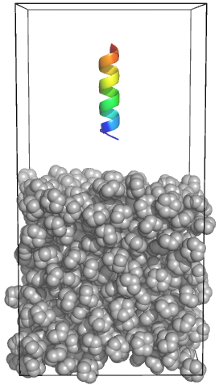

# Final Project

Simulate a biphasic system (water/cyclohexane) with and without the
KALP<sub>15</sub> peptide. All files and commands can coincidentally be found at
 this [tutorial](http://www.mdtutorials.com/gmx/biphasic/index.html). Final
 presentations will be during the final class on March 15th.

<p align="center">
  
</p>

## Project Instructions
1. Construct a box filled with water and cyclohexane.
2. Use the constructed system to perform a scaling analysis
  - Run each data point for at least 250 ps to ensure the simulation speed
  has converged.
  - _Note: do not exceed 2 nodes, even if the most efficient configuration utilizes
  more than 2 nodes._
3. Run classical MD on the biphasic system and observe the interface.
  - Run for 100 ns.
4. Calculate the average density (for water and cyclohexane separately) along
the z-axis for the production portion of the simulation (i.e., take small slices
 along the z-axis and calculate the density) and plot it as a function of z.
5. Repeat **step 1**, but add a KALP<sub>15</sub> peptide into the aqueous phase.
6. Run classical MD and observe how the peptide behaves.
  - Run for 300 ns.
7. Repeat steps 5-6, but with the peptide in the cyclohexane phase instead.

**Use VMD to create "publication ready" images of dominant peptide structures for
both simulations with the peptide.**

For Step 4, use the `MDTraj` python module, which can be installed by using
`conda install -c omnia mdtraj` or by following the instructions
[here](http://mdtraj.org/latest/installation.html).
- You may need to install Anaconda before this step if you do not have the `conda`
command. You can check if you have Anaconda by running `which conda` on the
command line. If you get a path as the output, then you have Anaconda installed.
If it returns nothing or a blank space, then Anaconda will need to be installed.

## Presentation
- Outline each of the steps above (with VMD images) and explain the shape of the
density profiles.

- Explain why you think the observed peptide configurations are dominant.

- Propose any further analysis that could be performed on this system to gain
better insight into what is happening.

 **Duration: 8 minutes + 2 minutes for questions**

## Activating GROMACS on Hyak

### Ikt
```bash
source /suppscr/pfaendtner/sarahh/scripts/environments/activate_gromacs18.3
```

### Mox
```bash
module load icc_17-impi_2017 #compiler used for gmx18/plumed2.4.2
source /gscratch/pfaendtner/sarah/codes/gromacs18.3/gromacs-2018.3/bin/bin/GMXRC
source /gscratch/pfaendtner/sarah/scripts/activate_plumed2.4.2.sh
```
